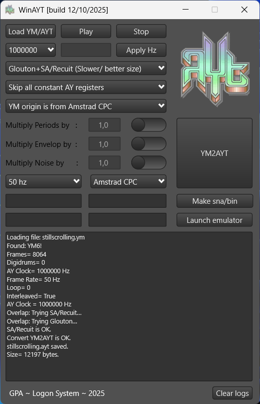
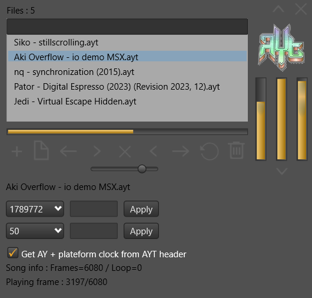
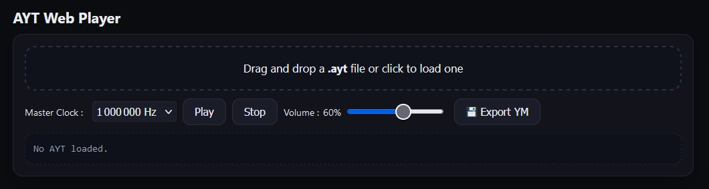

# Implementation

## Retrieving a YM File
The first step is to obtain a file in **YM5** or **YM6** format.  

It is possible to find an extraordinary number of them on various dedicated websites.

But it is also possible to start from your own compositions and export them in this format.

For example, **Arkos Tracker**[^1] offers a **YM** export option.

Some emulators, such as **WinAPE** (CPC), also allow capturing a **YM** stream.

Players such as **AY_Emul**[^2] support playback of numerous ZX Spectrum formats and provide this type of export.

Ideally, the **YM** file should contain only the music data — without extra silence at the beginning or end — and be as short as possible, playing the track only once (i.e., no recorded looping).  
It is therefore preferable to use a tracker to produce a **YM** file, as this avoids post-processing cleanup.

As part of the **AYT Project**, online tools have been developed.

One of them is a sequencer that allows manipulation of a **YM** file (range selection, deletion, export, etc.)

https://amstrad.neocities.org/ym-player-sequencer  


[^1]: https://www.julien-nevo.com/arkostracker/  
[^2]: http://bulba.untergrund.net/

---

## Converting a YM5/6 File to AYT
Once you’ve chosen your music, it must be processed by one of the converters available with the project.

There are different versions depending on your needs and preferred usage style:

- A **C++** version that can be recompiled on any platform supporting a C++ compiler.  
- A **JavaScript** version contained in a single HTML file, runnable locally in a browser.  
- Precompiled binaries are also provided.  
- An online version.  
- A complete **all-in-one application** that plays YM or AYT files, manages conversions, generates (for CPC) a demo source using the builder for your preferred assembler, and can even open your chosen emulator — or directly generate a **Snapshot (.SNA)** file ready to use.

---

### A Few Examples:

#### Online or Local HTML Version
You can access the online **YM5/6 to AYT** converter here:  
https://amstrad.neocities.org/ym2ayt  

This tool can also be downloaded for local use.


#### Windows All-in-One Application
This is a Windows tool written in Delphi, particularly well-suited for cross-development environments.  

A picture is worth a thousand words:



---

#### Listening to an AYT File
To check the result of your conversion, several applications allow you to listen to an **AYT** file.



There is also a web portal that does this:  
https://amstrad.neocities.org/aytwebplayer  


We are currently experimenting with a web-based jukebox that will be able to support the 100,000 existing AYT files.

http://aytproject.free.fr/


Finally, several web tools are accessible via a single menu.

https://amstrad.neocities.org/menuayt


---

## Using an AYT File on Your Platform

### AytPlayerBuilder
On each supported platform, a *builder* function exists.

It allows you to create a *player* in memory **from scratch**, based on a few input parameters.

Documentation is available in the source for each platform, detailing these parameters precisely.

These documents also include **timing performance metrics** (NOPS or TStates) and the **size** occupied by the *player* generated by the *builder*.

All players operate in **constant time**.  
Note, however, that on some platforms, the constant time is guaranteed only when the player is used **outside the display period**, since the CPU is shared with the video circuit accessing RAM.

For each platform, there are two **Z80A** source files.

Note that these sources were created with the integrated assembler of the *CPC WinAPE* emulator, which uses **MAXAM syntax**.  
No *“fake instruction”* (or other heretical directive of that sort) is used in these sources.  
They can be easily adapted for other assemblers.

Currently, sources exist for 5 platforms: **"CPC"**, **"CPC+"**, **"ZX"**, **"MSX"**, **"VG5000"**.

The first source contains the *Ayt_Builder* function, which is responsible for building the *player*.  
It is named **AytPlayerBuilder-[Platform].asm**  

For example, for the **MSX** platform, the file is named **AytPlayerBuilder-MSX.asm**.

The second source is a demo program using the *Ayt_Builder* function.  
It is named **AytPlayerBuilder-[Platform]-demo.asm**.  

To achieve this, it includes the *Ayt_Builder* source via the **read** directive.

For example:  
`read "AytPlayerBuilder-CPC.asm"`

The **AYT file** of your choice can be integrated into your code via the **incbin** directive, which inserts a binary file at the location of the directive.

For example:  
`incbin "mybestsong.ayt"`

---

### Compilation Option
All source files containing the *Ayt_Builder* function include a **compilation option** to define the **call method (CALL/JP)** used to invoke the player.  
This option is defined by default as follows:

```
PlayerAcessByJP   equ 0
```

- When this option is set to **0**, *Ayt_Builder* creates a player that must be called using the Z80A instruction **CALL**.  
- When set to **1**, *Ayt_Builder* creates a player that must be called using the Z80A instruction **JP** (in this case, an additional parameter is required during the function call).

It is recommended to leave this option at **0** by default, to avoid having to save and restore the stack pointer if you’re not using it for memory tricks.

Note that in the CPC+ platform’s *builder* source, there are additional compilation options specific to sound chip access methods.
