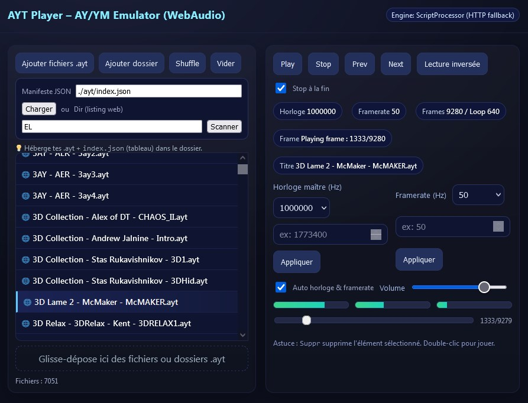

# Mise en oeuvre

## Récupérer un fichier YM
La première chose à faire est de récupérer un fichier au format **YM5** ou **YM6**. 

Il est possible d'en récupérer des quantités extraordinaires sur différents sites dédiés.

Mais il est aussi possible de partir de ses propres compositions, pour les exporter dans ce format. 

Par exemple **Arkos Tracker**[^1] propose un export **YM**.
 
Certains émulateurs, comme **Winape** (Cpc) permettent également de capturer un flux **YM**.

Des players comme **AY_Emul** [^2] gèrent la lecture de très nombreux formats ZX Spectrum et permettent ce type d'export.

Idéalement, il faut que le fichier **YM** contienne uniquement les données du morceau de musique, donc sans silence supplémentaire au début ou à la fin, et qu'il soit le plus court possible, et en ne jouant qu'une seule fois le morceau (on n'enregistre pas le rebouclage). 
Aussi il est préférable d'utiliser un tracker pour produire un **YM** car cela évite de devoir nettoyer à posteriori.

Dans le cadre du **AYT Project**, des outils en ligne ont été développé. 

L'un d'eux est un séquenceur qui permet de manipuler un fichier **YM** (sélection de plage, suppression, export,...)

https://amstrad.neocities.org/ym-player-sequencer

[^1]: https://www.julien-nevo.com/arkostracker/

[^2]: http://bulba.untergrund.net/

## Conversion d'un fichier YM5/6 en AYT

Une fois la musique choisie, il faut passer par l'un des convertisseurs disponibles avec le projet.
 
Il existe différentes versions selon les goûts, selon vos préférences d'usage.

- une version en C++ qui peut être recompilée sur toutes les plateformes capables de compiler du C++.
- une version en javascript contenue dans un seul fichier html qui tourne localement dans le navigateur. 
- Des binaires pré-compilés sont aussi mis à disposition. 
- Une version en ligne.
- Une application tout-en-un qui joue des YM ou AYT, gère les transformations, génère (pour CPC), un source de démo d'utilisation avec le builder selon votre assembleur préféré, et ouvre également l'émulateur de votre choix (ou même génère le fichier Snapshot (.SNA) directement utilisable. 

 
### Quelques exemples : 
#### Version en ligne ou html en local
Vous pouvez accéder au convertisseur en ligne **YM5/6** to **AYT** ici:
https://amstrad.neocities.org/ym2ayt

Cet outil peut être téléchargé pour être utilisé en local.

#### Application windows tout en un
Il s'agit d'un outil windows écrit en delphi, qui est assez bien adapté aux environnement de cross-dev.

Une image valant mille mots

#### Ecouter un fichier en AYT

Afin de contrôler le résultat de la conversion réalisée, plusieurs applications permettent d'écouter un fichier **AYT**.

Il existe également un portail qui le permet :

https://amstrad.neocities.org/aytwebplayer

En expérimentation, un jukebox web qui pourra supporter les 100 000 fichiers AYT déjà existants.

http://aytproject.free.fr/

## Utiliser un fichier AYT sur sa plateforme.

### AytPlayerBuilder
Sur les différentes plateformes gérées, une fonction *builder* existe.

Elle permet de créer ex nihilo un *player* en mémoire à partir de quelques paramètres en entrée de la fonction.

Une documentation existe au niveau du source pour chaque plateforme, afin de détailler plus précisément ces paramètres.

Ces documentations intègrent également les performances en temps (NOPS ou TStates) et la taille occupée par le *player* généré par le *builder*.

Les players sont tous en temps constant. A noter toutefois que pour certaines plateformes, le temps fixe est garanti lorsque le player est utilisé hors de la période d'affichage car la CPU est alors partagée pour permettre au circuit vidéo d'accéder à la ram.

Pour chaque plateforme, il existe deux fichiers source en **Z80A**.

A noter que ces sources ont été créés avec l'assembleur intégré de l'émulateur *CPC Winape*, qui respecte la syntaxe **MAXAM**.
Aucune *"fake instruction"* (ou autre directive hérétique de cette nature) n'est utilisé dans ces sources.
Ils sont facilement transposables sur d'autres assembleurs.

Ces sources existent actuellement pour 5 plateformes : **"CPC"**, **"CPC+"**, **"ZX"**, **"MSX"**, **"VG5000"**

Le premier contient la fonction *Ayt_Builder*, qui sert à construire le *player*.

Il est nommé **AytPlayerBuilder-[Plateforme].asm** 

Ainsi pour la plateforme **MSX**, le fichier s'appelle **AytPlayerBuilder-MSX.asm**

Le second source est un programme d'exemple utilisant la fonction *Ayt_Builder*. 
Il est nommé comme suit : **AytPlayerBuilder-[Plateforme]-demo.asm**

A cette fin il intègre le source de la fonction *Ayt_Builder* via la directive **read**
 
Par exemple : **read "AytPlayerBuilder-CPC.asm"**

Le **fichier AYT** de votre choix est intégrable dans votre code via la directive **incbin** qui permet d'intégrer un fichier binaire nommé à l'emplacement de la directive.

Par exemple : **incbin "mybestsong.ayt"**

### Option de compilation
Tous les sources qui contiennent la fonction *Ayt_Builder* disposent d'une **option de compilation** pour définir la **méthode d'appel (CALL/JP)** souhaitée.
Cette option est définie par défaut ainsi

**PlayerAcessByJP	equ 0**

- Lorsque cette option vaut **0**, cela signifie que *Ayt_Builder* créera un player qui devra être appelé avec l'instruction Z80A **CALL**.
- Lorsque cette option vaut **1**, cela signifie que *Ayt_Builder* créera un player qui devra être appelé avec l'instruction Z80A **JP** (dans ce cas, un paramètre complémentaire est nécessaire lors de l'appel de la fonction)

Il est conseillé de laisser cette option par défaut à 0 afin d'éviter de devoir sauvegarder et restituer le pointeur de pile si vous ne l'utilisez pas pour faire des galipettes dans la mémoire.

A noter que dans le source du *builder* de la plateforme CPC+, il existe d'autres options de compilation spécifiques aux méthodes d'accès au circuit sonore.

