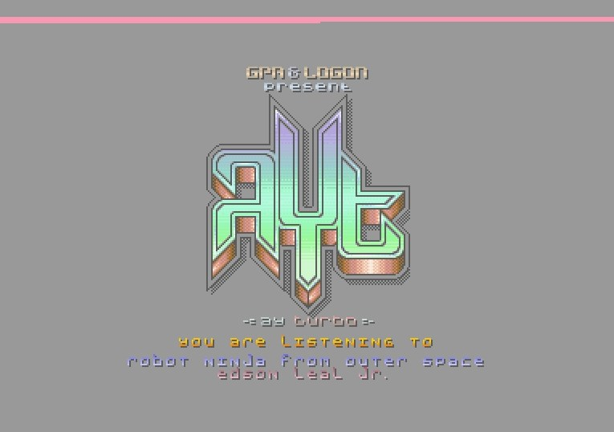
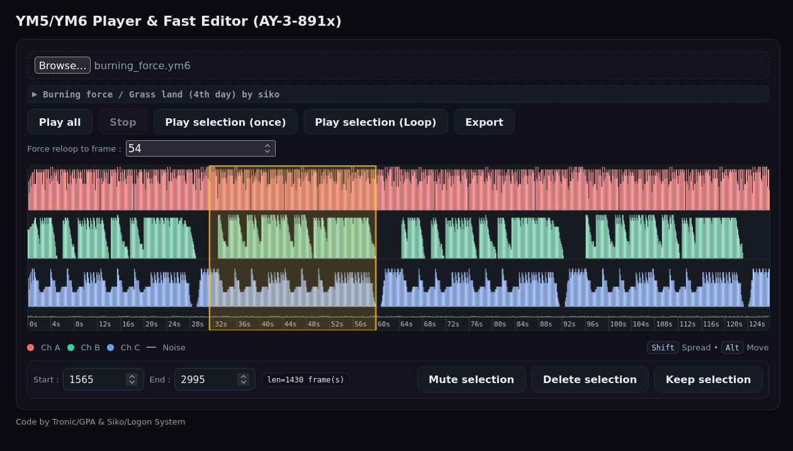

# LE FORMAT AYT
***Tronic*** (du groupe *GPA*), ***Longshot*** & ***Siko*** (du groupe *Logon System*) sont fiers de présenter un nouveau format de fichier audio appelé ***AYT***.
C'est un format compact associé utilisable simplement par tout programme nécessitant une haute performance **CPU** et un fonctionnement en **durée constante au cycle près**. 
Ce format est prévu pour toutes les plateformes utilisant un processeur sonore ***AY-3-8910/AY-3-8912*** (General Instrument) ou compatible (***YM-2149*** de Yamaha). 
Plusieurs outils de création et des players ont été réalisés et testés pour les plateformes suivantes : ***CPC***, ***CPC+***, ***MSX***, ***ZX 128***, ***VG5000 (VG5210)*** 

# Principe 

A partir d'un fichier audio **YM5/YM6** [^1], un fichier au format ***AYT*** est généré grâce à un convertisseur. 
Ce fichier ***AYT*** peut ensuite être lu par un player optimisé sur plusieurs plateformes. 
Le compresseur exploite la nature séquentielle des musiques pour optimiser l'organisation en mémoire.
Cette organisation impacte in fine le player, qui est construit en fonction de la musique. 
Le fichier **YM** est découpé en patterns, qui sont agencés via des séquences de patterns.  
Des optimisations complémentaires comme le retrait des registres inutilisés ou l'ordonnancement des données permettent de réduire la taille des fichiers et/ou le temps **CPU**.

[^1] Le format YM a été créé par Leonard (Arnaud Carré) http://leonard.oxg.free.fr/ymformat.html

## Caractéristiques 

- Plusieurs outils de compression sont disponibles pour créer des fichiers au format **AYT**
  - en ligne de commande quelque soit la plateforme.
  - directement sur le web.
- les fichiers **AYT** se compressent très bien avec ZX0 car les données ne sont pas déja compressées avec un algorithme de compression.
- un système de *builder* permet de créer un *player* à une adresse spécifiée et offre plusieurs avantages. 
  - il n'est plus nécessaire une fois le *player* créé et peut donc être totalement absent du programme dans lequel le *player* est utilisé.
  - il est de taille modeste.
  - il génère la routine d'initialisation des registres inacrtifs (cette routine étant transparente pour les utilisateurs de CPC "old")
  - il n'est pas nécessaire d'appeler le *builder* si la musique reboucle ou pour initialiser les registres. 
- le *player* est construit par le *builder* en fonction de la musique qu'il devra jouer
  - il est très performant en **CPU** (*voir tableaux de performances*).
  - il occupe peu de place en mémoire. 
  - il ne nécessite aucun buffer de décompression et permet ainsi de réduire l'empreinte mémoire du *player* en Ram.
  - il gère un nombre paramétrable de bouclage des musiques tel qu'il est défini dans le fichier **YM** (le rebouclage n'a pas forcément lieu au début)
  - il gère l'arrêt du son à l'issue du/des rebouclages (Les fichiers **YM** ne le font pas tous)
  - il fonctionne en temps constant dans toutes les circonstances (rebouclage, mute du player une fois la musique finie)
  - il permet de jouer des musiques de toutes tailles, et seulement limitées par l'espace adressable du processeur ou les capacités mémoire de la machine.

## Performances

Les performances en temps d'exécution et de place mémoire du Player dépendent de plusieurs facteurs:
- Le nombre de registres actifs détectés par le compresseur (au maximum de 14).
- La plateforme utilisée (les accès au **AY-3-8912** sur un CPC d'ancienne génération sont particulièrement gourmands).
- La *méthode d'appel* du *player* (**CALL** ou **JP**) sur toutes les plateformes
- Le choix de la *connexion/déconnexion* systématique de la **page ASIC** dans le cadre du **CPC+**.

La *méthode d'appel* correspond à la façon dont le *player* est appelé en Z80A.
Cette méthode est une option de compilation du *builder*.
- Lorsque la *méthode d'appel* est de type **CALL**, le programme qui utilise le *player* doit l'appeler avec l'instruction Z80A **"CALL"**
- Lorsque la *méthode d'appel* est de type **JP**, le *player* doit être appelé avec l'instruction Z80A **"JP"**. Cette méthode nécessite toutefois que le programmeur fournisse au *builder* l'adresse de retour du *player*.
  - Le *player* ne sauvegarde alors pas le registre **SP**, ce qui permet de *"gagner"* **11 nops** (sur **CPC**) ou **37 Ts**.
  - C'est une option intéressante seulement si le programme qui appelle le player devait de toute manière modifier le registre **SP**.
  - Dans les autres cas, elle présente les problèmes suivants :
    - elle impose d'appeler le *builder* à chaque fois que l'adresse de retour change :
      - cela peut se produire fréquemment en *développement*, ce qui impose d'avoir le *builder* en ram.
      - cela peut se produire si il est nécessaire d'appeler le *player* de plusieurs endroits différents.
    - elle impose de restaurer le pointeur de pile car le moindre push ou call serait destructeur pour les données **AYT**.
  
Par plateforme, les tableaux ci-dessous détaillent les performances du *player* entre 10 et 14 registres actifs pour les deux *méthodes d'appel* possibles.

***AMSTRAD CPC 464/664/6128***

| Méthode Appel | Nombre Registres | CPU en Nops | Taille Player | Taille Builder |
| :-----------: | :--------------: | :---------: | :-----------: | :------------: |
| CALL          | 10               | 369         | 252           | 480            |
| JP            | 10               | 358         | 247           | 466            |
| CALL          | 11               | 400         | 268           | 480            |
| JP            | 11               | 389         | 264           | 466            |        
| CALL          | 12               | 431         | 286           | 480            |
| JP            | 12               | 320         | 281           | 466            |        
| CALL          | 13               | 461         | 302           | 480            |
| JP            | 13               | 450         | 297           | 466            |        
| CALL          | 14               | 490         | 317           | 480            |
| JP            | 14               | 479         | 312           | 466            |        

***AMSTRAD CPC 464+/6128+/GX 4000***

| Méthode Appel | Page Asic ON/OFF | Nombre Registres | CPU en Nops | Taille Player | Taille Builder |
| :-----------: | :---------------:| :--------------: | :---------: | :-----------: | :------------: |
| CALL          | OUI              | 10               | 202         | 145           | 387            |
| JP            | NON              | 10               | 178         | 131           | 372            |
| CALL          | OUI              | 11               | 214         | 151           | 387            |
| JP            | NON              | 11               | 190         | 137           | 372            |        
| CALL          | OUI              | 12               | 226         | 157           | 387            |
| JP            | NON              | 12               | 202         | 143           | 372            |        
| CALL          | OUI              | 13               | 238         | 163           | 387            |
| JP            | NON              | 13               | 214         | 149           | 372            |        
| CALL          | OUI              | 14               | 250         | 169           | 387            |
| JP            | NON              | 14               | 226         | 155           | 372            | 

    
***ZX SPECTRUM/+2/+3***

| Méthode Appel | Nombre Registres | CPU en Tstates | Taille Player | Taille Builder |
| :-----------: | :--------------: | :---------: | :-----------: | :------------: |
| CALL          | 10               | 722         | 153           | 353            |
| JP            | 10               | 685         | 148           | 338            |
| CALL          | 11               | 775         | 160           | 353            |
| JP            | 11               | 738         | 155           | 338            |    
| CALL          | 12               | 828         | 167           | 353            |
| JP            | 12               | 791         | 162           | 338            |        
| CALL          | 13               | 881         | 174           | 353            |
| JP            | 13               | 844         | 169           | 338            |        
| CALL          | 14               | 934         | 181           | 353            |
| JP            | 14               | 897         | 176           | 338            |  

***MSX***

| Méthode Appel | Nombre Registres | CPU en Tstates | Taille Player | Taille Builder |
| :-----------: | :--------------: | :---------: | :-----------: | :------------: |
| CALL          | 10               | 680         | 141           | 370            |
| JP            | 10               | 643         | 136           | 355            |
| CALL          | 11               | 729         | 147           | 370            |
| JP            | 11               | 692         | 142           | 355            |    
| CALL          | 12               | 778         | 153           | 370            |
| JP            | 12               | 741         | 148           | 355            |        
| CALL          | 13               | 827         | 160           | 370            |
| JP            | 13               | 790         | 155           | 355            |        
| CALL          | 14               | 876         | 166           | 370            |
| JP            | 14               | 839         | 161           | 355            |  

***VG 5000 (WITH VG5210/5232)***

| Méthode Appel | Nombre Registres | CPU en Tstates | Taille Player | Taille Builder |
| :-----------: | :--------------: | :---------: | :-----------: | :------------: |
| CALL          | 10               | 680         | 141           | 370            |
| JP            | 10               | 643         | 136           | 355            |
| CALL          | 11               | 729         | 147           | 370            |
| JP            | 11               | 692         | 142           | 355            |    
| CALL          | 12               | 778         | 153           | 370            |
| JP            | 12               | 741         | 148           | 355            |        
| CALL          | 13               | 827         | 160           | 370            |
| JP            | 13               | 790         | 155           | 355            |        
| CALL          | 14               | 876         | 166           | 370            |
| JP            | 14               | 839         | 161           | 355            |  

## Objectifs

Un des objectifs initiaux de ce projet était **la création d'un nouveau format de fichier son conciliant un player très efficace en terme CPU, tout en restant raisonnable sur la taille des données en Ram**.
Il s'agissait de sortir d'un paradigme classique impliquant des compressions avec des buffers gourmands et ayant atteint leurs limites depuis longtemps.
Le principe utilisé ne *"compresse"* pas les données brutalement mais s'appuie sur la logique particulière de compositions des chiptunes.
Cette particularité confère à un fichier **AYT** la capacité de  pouvoir être compressé par un compacteur de type **ZX0** ou **Shrinker** de manière plus performante que de nombreux autres formats *"déjà compressés"*. Cela permet ainsi de stocker un fichier AYT sur disque ou en ram de manière très performante au regard des solutions existantes.

 
Comme souvent lorsqu'on tend vers les limites d'architecture, la vitesse s'oppose à la place occupée en mémoire (*There is no free lunch*).
Le compromis **Cpu versus Taille** du format **AYT** nous a semblé assez raisonnable pour que nous décidions de le partager.

Des évolutions pour réduire la taille des fichiers **AYT** sont déjà à l'étude, car ce format le permet facilement.
Il devrait conserver tous les atouts pour rester très performant au niveau **CPU**. :-)

Un autre objectif important était de **simplifier le processus de création et d'utilisation de ce format**, car c'est malheureusement souvent loin d'être le cas dans ce domaine, que ce soit au niveau des **compresseurs ou des players**.

### Simplification de la compression
Au niveau de la compression, lorsque d'autres formats sont convertis à partir du format **YM**, il est souvent nécessaire de saisir des options parfois peu compréhensibles.
Une conversion à partir du format **YM** suppose de tenir compte des informations relatives à la **fréquence des sons de la plateforme source et ceux de la plateforme d'arrivée**.

Si ce type d'option reste possible avec les outils créés pour **AYT**, le processus a été grandement simplifié grâce à une **codification des plateformes** (voir format du **AYT**) et le souci d'en demander le moins possible à l'utilisateur.
Il suffit d'indiquer au compresseur quelle est la plateforme cible et il se charge seul de la conversion en tenant compte des fréquences de base et d'arrivée, tout en calculant les meilleurs compromis en terme de taille.

Le format AYT **contient dans son header l'information de la plateforme et la fréquence d'appel du player**, ce qui permet de convertir des fichiers **AYT** prévus pour une plateforme A vers une plateforme B.

Le compresseur existe également sur une **interface web** très simple à utiliser.
L'algorithme cherchera la meilleure compression possible sans qu'il soit nécessaire de refaire des essais, ou, pire, de de déteriorer des données.

Enfin, et parce que le format **YM** est parfois taillé à la hâche (fichier mal "terminés"), une autre interface web **permet de séquencer (écouter, couper, manipuler des fichiers YM**.
De quoi réaliser de beaux medley AY...

### Simplification du player
Au niveau de l'utilisation d'un fichier **AYT**, le processus est simplifié à l'extrême. 

Sur un **CPC-** par exemple en mode d'appel **CALL**, le programme indique au *builder* l'adresse où le *player* doit être créé, l'adresse où la musique se trouve et le nombre de fois qu'elle sera jouée.

Le *builder* renvoie au programme **l'adresse du premier octet libre après le player**, ainsi que **le nombre de µsecondes qu'occupera le player avec le CALL**.
(c'est utile pour les programmes gérant des processus en temps constant).

Lorsque le *player* est appelé la première fois, il initialise les registres "inactifs" avec **la même durée CPU que pour les appels suivants** qui vont jouer la musique.

 ### Statistiques

Sur un corpus de 10000 musiques, il est possible de déduire les prochains axes d'amélioration du format et de son player.
<...>
 

# Mise en oeuvre

## Produire un YM
La première chose à faire est de récupérer un fichier au format **YM5** ou **YM6**. Il est possible d'en récupérer des quantités extraordinaires sur différents sites dédiés, mais il est possible de partir de ses propres compositions, pour les exporter dans ce format. 

Par exemple Arkos Tracker[^3] propose un export **YM**. 
Certains émulateurs, comme *winape* (Cpc) permettent de capturer un flux **YM**.

Idéalement, il faut que ce fichier contienne uniquement les données du morceau de musique, donc sans silence supplémentaire au début ou à la fin, et qu'il soit le plus court possible, et en ne jouant qu'une seule fois le morceau (on n'enregistre pas le rebouclage). 
Aussi il est préférable d'utiliser un tracker pour produire un **YM** car cela évite de devoir nettoyer à posteriori.

Un outil en ligne a été développé afin de permettre de manipuler un fichier **YM** (sélection de plage, suppression, fusion, export,...)

https://amstrad.neocities.org/ym-player-sequencer

[^2] L'assembleur utilisé est celui intégré à l'émulateur CPC WINAPE qui utilise un format proche du format MAXAM.

[^3] https://www.julien-nevo.com/arkostracker/

## Conversion en AYT

Il faut ensuite passer par l'un des convertisseurs fournis. 
Il existe différentes versions qui font à peu près la même chose, à savoir convertir un fichier **YM** en **AYT**. 
- une version en C++ qui peut être recompilée sur toutes les plateformes capables de compiler du C++.
- une version en javascript contenue dans un seul fichier html qui tourne localement dans le navigateur. 
- Des binaires pré-compilés sont aussi mis à disposition. 
 
Ici nous détaillerons les versions C++

### Version en ligne ou html (en local)
Voci le lien sur le convertisseur en ligne YM5/6 to AYT
https://amstrad.neocities.org/ym2ayt

Ces outils peuvent être téléchargés pour être utilisés en local.

**Remarque :**
La conversion crée le fichier AYT, et exporte le source de *Ayt_Builder* et celui d'un programme d'exemple capable de jouer la musique sur la plateforme cible sélectionnée.

### Version c++
En ligne de commande

### Ecouter un fichier en AYT

Une application (windows) permet d'écouter un fichier **AYT** :

Une interface web permet également d'écouter un fichier **AYT** :

https://amstrad.neocities.org/ayt-web-player

## Mise en oeuvre de Ayt_Builder

Pour chaque plateforme, il existe deux fichiers source en **Z80A**.[^2]

Le premier contient la fonction *Ayt_Builder*, qui sert à construire le *player*.

Le source est nommé **AytBuilder[Plateforme]-v[x].asm** 

Ainsi pour la plateforme **MSX** et la version 2 de la fonction, le fichier s'appelle **AytBuilderMSX-v2.asm**

Le second source est un programme d'exemple utilisant la fonction *Ayt_Builder*.
A cette fin il intègre le source de la fonction *Ayt_Builder* via la directive **read**
 
Par exemple : **read "AytbuilderCpc-v2.asm"**

Le source qui contient la fonction *Ayt_Builder* contient une **option de compilation** pour définir la **méthode d'appel (CALL/JP)** souhaitée.
Cette option est définie par défaut ainsi

**PlayerAcessByJP	equ 0**

- Lorsque cette option vaut **0**, cela signifie que *Ayt_Builder* créera un player qui devra être appelé avec l'instruction **CALL**.
- Lorsque cette option vaut **1**, cela signifie que *Ayt_Builder* créera un player qui devra être appelé avec l'instruction **JP** (dans ce cas, un paramètre complémentaire est nécessaire lors de l'appel de la fonction)

Sauf à vouloir briller en société en prétendant avoir économisé **11 µsecondes** (ou **37 Tstates**), je vous conseille de laisser cette option à 0, ce qui vous évitera notamment de devoir sauvegarder et restituer le pointeur de pile.

Le **fichier AYT** de votre choix est intégrable dans votre code via la directive **incbin** qui permet d'intégrer un fichier binaire nommé à l'emplacement de la directive.

Par exemple : **incbin "mybestsong.ayt"**

### Pré-Construction!
Il est tout à fait possible de ***"pré construire"*** le *player*.

Vous pouvez utiliser *Ayt_Builder* pour créer préalablement le *player* et initialiser le fichier **AYT**.
Il suffit de sauvegarder le player créé et le fichier **AYT** mis à jour après l'appel de la fonction.

Vous pouvez ensuite intégrer le *player* et le fichier **AYT** en prenant soin de les replacer aux adresses définies lors de l'appel à *Ayt_Builder*.

### Appel de la fonction
La fonction *Ayt_Builder* nécessite quelques paramètres en entrée, qui peuvent varier selon la **plateforme**.
Ces différences sont décrites ci-après dans la description de la plateforme qui vous intéresse.

### Appel de Ayt_Builder sur CPC 464/664/6128

		ld ix,AYT_File		; AYT_File est l'adresse où se trouve le fichier AYT
		ld de,AYT_Player	; AYT_Player est l'adresse où le player sera construit
		ld a,2			; A indique combien de fois la musique sera jouée
		call Ayt_Builder

A la sortie de la fonction *Ayt_Builder* :
- le registre **DE** contient l'adresse du premier octet libre après le *player*.
- le registre **HL** contient le nombre de µsecondes (NOPs) consommé par l'appel du *player*.

Pour jouer la musique, il faut appeler le *player* à la fréquence requise. 
La majorité des musiques nécessitent que le *player* soit appelé périodiquement 50 fois par seconde.
L'entête du fichier **AYT** indique cette période. 

Il est très **important de s'assurer qu'aucune interruption ne pourra avoir lieu pendant l'appel du player**. Si vous n'êtes pas familier avec le système des interruptions en **Z80A**, vous pouvez utiliser l'instruction **DI** avant l'appel du *player*.

		call AYT_Player	; Joue la musique

Si l'option **PlayerAcessByJP** vaut 1, il faut également définir l'adresse de retour du *player*.

		ld ix,AYT_File			; AYT_File est l'adresse où se trouve le fichier AYT
		ld de,AYT_Player		; AYT_Player est l'adresse où le player sera construit
		ld hl,AYT_Player_Ret		; AYT_Player_Ret est l'adresse à laquelle le player revient
		ld a,2				; A indique combien de fois la musique sera jouée
		call Ayt_Builder

On retrouve l'adresse de retour derrière l'appel du *player** 

			jp AYT_Player	; Joue la musique
	AYT_Player_Ret			; Adresse de retour du player
 
Vous pouvez vous rapporter au tableau des performances pour connaitre la Cpu et la taille du *player* généré.

***Remarques :***
- Le *player* met le circuit sonore en sourdine une fois le nombre de reboucle effectué.
- Si des registres nécessitent une initialisation, cette dernière est faite de manière transparente avec le 1er appel.
- La reboucle a lieu à l'endroit ou elle a été prévue par le fichier **YM**.
- Que ce soit lors de la reboucle ou lors de la mise en sourdine du *player*, ce dernier respectera à chaque appel une durée de Cpu constante.

#### Périodicité d'appel de Ayt_Player_
La périodicité d'appel du *player* est généralement basée sur la fréquence de l'écran, qui est de 50 Hertz. 
Cette information est disponible dans l'entête du fichier AYT (voir la description du format **AYT**).
Sur CPC 464/664/6128, la fréquence de 50 Hz est induite par le paramétrage du **CRTC 6845**, qui signale son signal de Vsync via le **PPI 8255**.
Il est possible de tester le signal de Vsync avec le code suivant :

           ld b,#f5        ; port B du PPI 8255
    Wait_Vsync
            rra             ; Test du bit 0 
            jr nc,Wait_Vsync     ; Attente que le bit 0 passe à 1

Les interruptions sur les CPC offrent aussi la possibilité de se synchroniser de manière très précise.

### Appel de Ayt_Builder sur CPC 464+/6128+/GX4000 

Sur les machines "CPC+" de Amstrad, il y a quelques paramètres complémentaires, liés aux spécificités techniques de ces machines, qui intègrent des **DMA** permettant de mettre à jour les registres **AY** *presque* automatiquement.

		ld ix,AYT_File		; AYT_File est l'adresse où se trouve le fichier AYT
		ld de,AYT_Player	; AYT_Player est l'adresse où le player sera construit
		ld a,2			; A indique combien de fois la musique sera jouée
		ld iy,AYT_Init			; AYT_Init est l'adresse ou est créée la fonction d'initialisation si <>de 0
		ld bc,AYT_DmaList		; AYT_DmaList est l'adresse d'un buffer pour une dma-list
		call Ayt_Builder

Il existe quelques contraintes inhérentes à l'espace occupé par la page d'entrées sorties que je vais nommer ici **page Asic**.

La **page Asic**, qui permet l'accès aux paramètrages des **DMA**, est située entre **0x4000 et 0x7FFF**. 
Lorsqu'elle est connectée, elle occulte la ram située à cet emplacement. 
- L'adresse de *AYT_Player* ne doit en aucun cas être définie entre **0x4000 et 0x7FFF** car ce dernier a besoin d'écrire dans la **page Asic** pour fonctionner.
- Le fichier **AYT** peut être placé n'importe où en ram à condition de laisser le *player* gérer lui même la connexion de la **page Asic**.

Tout comme pour le *player* des anciens modèles CPC, il est possible de définir l'option **PlayerAccessByJP** qui impose de placer dans le registre HL l'adresse de retour du *player* lors de l'appel de *Ayt_Builder*.
Elle permet de gagner *11 µsecondes* si le programme appelant modifie lui même le pointeur de pile. Si ce n'est pas le cas de votre programme, cette option doit être laissée à 0 pour vous éviter d'avoir à sauvegarder vous même le pointeur de pile (ceka éviter d'écraser les données **AYT**).

L'option **PlayerConnectAsic** dans *Ayt_Builder* permet de définir si c'est le *player* qui connectera et déconnectera la **page Asic**.
Si le fichier **AYT** déborde entre **0x4000 et 0x7FFF**, le programme appelant le player devra s'assurer que la **page Asic** n'est pas connectée.

Si cette option est définie à 1, le **player** pourra lire le fichier **AYT** entre **0x4000 et 0x7FFF** et connectera la **page Asic** une fois ce travail réalisé pour accéder aux contrôles **DMA**.
Par défaut, **PlayerConnectAsic	equ 1** pour permettre de placer le fichier **AYT** n'importe où en mémoire.

Dans l'hypothèse où le fichier **AYT** ne serait pas situé entre **0x4000 et 0x7FFF**, et que le programme qui appelle le *player* fonctionne avec la *page Asic* connectée, cette option doit valoir 0.
**PlayerConnectAsic	equ 0** permet d'éviter que le *player* ne déconnecte la *page Asic* et oblige le programme principal à la reconnecter ensuite.
Ainsi positionné, cette option fait "gagner" *13 µsecondes* au player.

Il existe deux autres options de compilation pour *Ayt_Builder* spécifiques aux capacités hardware des machines "Plus".
- **PlayerDMAUsed_SAR** permet de définir quel DMA parmi les 3 disponibles sera utilisé par le *player*.
  - 3 équivalences sont pré-définies dans le source : **AYT_Asic_SAR0**, **AYT_Asic_SAR1**, **AYT_Asic_SAR2**
  - Par défaut le canal dma utilisé est le 0 : **PlayerDMAUsed_SA equ AYT_Asic_SAR0**
  - Pour en changer, si vous l'utilisez déjà par ailleurs, il suffit de modifier le numéro 0 de l'équivalence.
- **PlayerDMAUsed_DCSRMask** permet de définir le masque utilisé par le *player* pour cohabiter avec les autres canaux **DMA** sans les perturber.
  - 3 équivalences sont pré-définies dans le source : **AYT_Asic_DCSRM0**, **AYT_Asic_DCSRM1**,**AYT_Asic_DCSRM2**
  - Ce paramètre doit définir le même canal DMA que celui défini avec **PlayerDMAUsed_SAR**
  - Par défaut le canal dma utilisé est le 0 : **PlayerDMAUsed_DCSRMask	equ AYT_Asic_DCSRM0**

Pour jouer la musique, il faut appeler le *player* à la fréquence requise. 
La majorité des musiques nécessitent que le *player* soit appelé périodiquement 50 fois par seconde.
L'entête du fichier **AYT** indique cette période. 

Il est très **important de s'assurer qu'aucune interruption ne pourra avoir lieu pendant l'appel du player**. Si vous n'êtes pas familier avec le système des interruptions en Z80A, vous pouvez utiliser l'instruction **DI** avant l'appel du *player*.

		call AYT_Player	; Joue la musique

 
#### Initialisation
Si le compresseur identifie des registres dit *inactifs*, ils sont exclus des données **AYT** mais nécessitent néanmoins une initialisation préalable.

Le player du "Plus" étant bien plus rapide que sur les CPCs de première génération, sa vitesse d'exécution peut devenir inférieure à celle que prendrait la routine d'initialisation (qui n'utilise pas de **DMA**).
Il est donc nécessaire d'appeler une fonction d'initialisation avant d'appeler le *player*.

La fonction *Ayt_Builder* construit une routine d'initialisation qui sera appelée **avant** l'utilisation du *player*.
Deux alternatives se présentent en entrée de la fonction:
- Si le registre **IY vaut 0**, alors la fonction *AYT_Builder* va réserver **34 octets** après le *player* pour créer cette routine.
- Si le registre **IY est différent de 0**, il doit alors contenir l'adresse d'une zone réservée de **34 octets** (qui peut se situer n'importe ou en ram).

A la sortie de la fonction *Ayt_Builder*:
- le registre **HL** contient l'adresse de la routine d'initialisation (il vaut donc IY si ce dernier était non nul).
- le registre **DE** contient le pointeur sur le premier octet libre après le *player* (ou la routine d'initialisation).

**Remarque :**

Si le fichier ne contient aucun registre inactif, la routine d'initialisation devient inutile.
Dans ce cas, la fonction d'initialisation pointera sur un RET (et la routine d'initialisation occupera alors un octet au lieu de 34).

Voici le traitement à mettre en place pour appeler une routine d'initialisation 

		ld ix,AYT_File		; AYT_File est l'adresse où se trouve le fichier AYT
		ld de,AYT_Player	; AYT_Player est l'adresse où le player sera construit
		ld a,2			; A indique combien de fois la musique sera jouée
		ld iy,0			; IY=0, Ayt_Builder va allouer 1 ou 34 octets de rams
		ld bc,AYT_DmaList	; AYT_DmaList est l'adresse d'un buffer pour une dma-list
		call Ayt_Builder
		ld (InitPlayer),hl	; Mise a jour de la routine d'initialisation
		...
		...
	InitPlayer equ $+1
		call 0			; Après la mise à jour, CALL sera sur la routine d'initialisation
 
#### DMA-List

Le *player* a besoin d'une zone de **30 octets maximum** pour gérer une **DMA-Liste**.
C'est cette DMA-Liste qui permet au CPC+ d'envoyer les données au générateur sonore en parallèle.
L'adresse de cette zone doit impérativement être fournie à la fonction *Ayt_Builder* dans le registre **BC** et ne peut actuellement pas être allouée automatiquement par la fonction.
Elle doit respecter quelques règles strictes :
- l'adresse fournie pour la zone de 30 octets **ne doit pas être à cheval entre 2 pages de 256 octets**.
- l'adresse doit débuter sur **une adresse paire**. Autrement dit le bit de poids faible de l'adresse vaut 0.
- l'adresse ne doit pas se situer **entre 0x4000 et 0x7FFF** si l'option **PlayerConnectAsic	equ 0** ou que le programme appelant laisse la **page Asic** connectée dans cet espace.

#### Périodicité d'appel de Ayt_Player
La périodicité d'appel du *player* est généralement basée sur la fréquence de l'écran, qui est de 50 Hertz. 
Cette information est disponible dans l'entête du fichier **AYT** (voir la description du format **AYT**)
.
Sur CPC 464/664/6128, la fréquence de 50 Hz est induite par le paramétrage du **CRTC 6845**, qui signale son **signal VSYNC** via le **PPI 8255**.
Il est possible de tester le signal Vsync avec le code suivant :

           ld b,#f5        ; port B du PPI 8255
    Wait_Vsync
            rra             ; Test du bit 0 
            jr nc,Wait_Vsync     ; Attente que le bit 0 passe à 1

Les interruptions sur les CPC offrent aussi la possibilité de se synchroniser de manière très précise.
 
### Appel de Ayt_Builder sur ZX SPECTRUM 128/+2/+3

		ld ix,AYT_File		; AYT_File est l'adresse où se trouve le fichier AYT
		ld de,AYT_Player	; AYT_Player est l'adresse où le player sera construit
		ld bc,AYT_Init			; AYT_Init est l'adresse ou est créée la fonction d'initialisation si <>de 0
            ld a,1	; Nb of loop for the music
		call AYT_Builder	; Build the player @DE for file pointed by @IX for "A" loop

Pour jouer la musique, il faut appeler le *player* à la fréquence requise. 
La majorité des musiques nécessitent que le *player* soit appelé périodiquement 50 fois par seconde.
L'entête du fichier *AYT* indique cette période. 

Il est très **important de s'assurer qu'aucune interruption ne pourra avoir lieu pendant l'appel du player**. Si vous n'êtes pas familier avec le système des interruptions en **Z80A**, vous pouvez utiliser l'instruction **DI** avant l'appel du *player*.

		call AYT_Player	; Joue la musique

Si l'option PlayerAcessByJP vaut 1, il faut également définir l'adresse de retour du *player*.

		ld ix,AYT_File			; AYT_File est l'adresse où se trouve le fichier AYT
		ld de,AYT_Player		; AYT_Player est l'adresse où le player sera construit
		ld bc,AYT_Init			; AYT_Init est l'adresse ou est créée la fonction d'initialisation si <>de 0
		ld hl,AYT_Player_Ret		; AYT_Player_Ret est l'adresse à laquelle le player revient
		ld a,2				; A indique combien de fois la musique sera jouée
		call Ayt_Builder

On retrouve l'adresse de retour derrière l'appel du *player* 

			jp AYT_Player	; Joue la musique
	AYT_Player_Ret			; Adresse de retour du player

#### Initialisation
Si le compresseur identifie des registres *inactifs*, ils sont exclus des données **AYT** mais nécessitent néanmoins une initialisation préalable.

Il est nécessaire d'appeler une fonction d'initialisation avant d'appeler le player.

La fonction *Ayt_Builder* construit une routine d'initialisation qui sera appelée **avant** l'utilisation du *player*.
Deux alternatives se présentent en entrée de la fonction:
- Si le registre **BC vaut 0**, alors la fonction *AYT_Builder* va réserver **16 octets** après le *player* pour créer cette routine.
- Si le registre **BC est différent de 0**, il doit alors contenir l'adresse d'une zone réservée de **16 octets** (qui peut se situer n'importe ou en ram).

A la sortie de la fonction *Ayt_Builder*:
- le registre **HL** contient l'adresse de la routine d'initialisation (il vaut donc BC (en entrée) si ce dernier était non nul).
- le registre **DE** contient le pointeur sur le premier octet libre après le *player* (ou la routine d'initialisation).

**Remarque :**

Si le fichier ne contient aucun registre inactif, la routine d'initialisation devient inutile.
Dans ce cas, la fonction d'initialisation pointera sur un RET (et la routine d'initialisation occupera alors un octet au lieu de 34).

Voici le traitement à mettre en place pour appeler une routine d'initialisation 

		ld ix,AYT_File		; AYT_File est l'adresse où se trouve le fichier AYT
		ld de,AYT_Player	; AYT_Player est l'adresse où le player sera construit
		ld bc,AYT_Init			; AYT_Init est l'adresse ou est créée la fonction d'initialisation si <>de 0
            ld a,2	; Nb of loop for the music
		call AYT_Builder	; Build the player @DE for file pointed by @IX for "A" loop

		ld (InitPlayer),hl	; Mise a jour de la routine d'initialisation
		...
		...
	InitPlayer equ $+1
		call 0			; Après la mise à jour, CALL sera sur la routine d'initialisation

#### Périodicité d'appel de Ayt_Player
La périodicité d'appel du *player* est généralement basée sur la fréquence de l'écran, qui est de 50 Hertz. 
Cette information est disponible dans l'entête du fichier **AYT** (voir la description du format **AYT**).

**Avertissement :** Le player a été testé sur l'émulateur **ZX SPIN 0.666** qui dispose d'un assembleur intégré mais qui s'est avéré assez buggé sur ma machine.
Pardonnez par avance les erreurs que je pourrais formuler ici, n'étant pas familier du ZX SPECTRUM 128.

A priori, il n'existe pas de signal Vsync testable sur ZX SPECTRUM 128.

Il existe cependant une interruption produite une fois par frame.
Sur le Z80A en mode IM 1, une interruption génère un **RST 0x38h**, qui représente un **CALL 0x0038h**.
Cependant la ROM, qui ne peut pas être déconnectée de l'espace adressable, débute en 0x0000.
L'appel des interruptions a donc lieu dans la ROM, qui semble ne pas avoir prévu de passerelle en RAM.

Fort heureusement, le Z80A permet de déplacer ses interruptions via le mode IM2 (mode vectorisé).
Ce mode a rarement été exploité dans les architectures des anciennes plateformes.
Pour l'utiliser il faut tricher un peu pour contourner l'absence de périphériques vectorisés, et construire une table de vecteurs compatible avec toutes les situations.

Sans rentrer dans des considérations trop techniques qui dépasseraient le cadre de ce document, voici la méthode employée pour cadencer l'appel de *AYT_Player**

		;
		; Swith to Im2
            ; 
		ld bc,256		; 257 bytes to write
		ld a,&c9		; between C900 and CA00 included
		ld h,a			; with C9 byte = RET
		ld l,c
		ld (hl),a
		ld d,h
		ld e,b
		ldir
		ld i,a			; Msb of vector tab
		im 2           ; switch to interrupt mode 2

Ainsi c'est l'instruction Z80A **HALT**, placée derrière le EI qui attend que l'interruption Vsync se produise.
La table d'interruption créé entre **0xC900h et 0xCA00h contient** des **0xC9h**, qui correspondent à l'instruction **RET** en Z80A.
Une fois que l'interruption s'est produite, elle ne peut plus se reproduire avant le prochain **EI**.

		di
		call AYT_Player
		ei			; Int authorized
		halt		; wait for irq on vsync via Im2

### Appel de Ayt_Builder sur MSX

		ld ix,AYT_File		; AYT_File est l'adresse où se trouve le fichier AYT
		ld de,AYT_Player	; AYT_Player est l'adresse où le player sera construit
		ld bc,AYT_Init			; AYT_Init est l'adresse ou est créée la fonction d'initialisation si <>de 0
            ld a,2	; Nb of loop for the music
		call AYT_Builder	; Build the player @DE for file pointed by @IX for "A" loop

Pour jouer la musique, il faut appeler le *player* à la fréquence requise. 
La majorité des musiques nécessitent que le *player* soit appelé périodiquement 50 fois par seconde.
Sur MSX cependant, la fréquence de rafraichissement vidéo est souvent de 60 Hz.
L'entête du fichier **AYT** indique cette période. 

Il est très **important de s'assurer qu'aucune interruption ne pourra avoir lieu pendant l'appel du player**. Si vous n'êtes pas familier avec le système des interruptions en Z80A, vous pouvez utiliser l'instruction **DI** avant l'appel du *player*.

		call AYT_Player	; Joue la musique

Si l'option PlayerAcessByJP vaut 1, il faut également définir l'adresse de retour du *player*.

		ld ix,AYT_File			; AYT_File est l'adresse où se trouve le fichier AYT
		ld de,AYT_Player		; AYT_Player est l'adresse où le player sera construit
		ld bc,AYT_Init			; AYT_Init est l'adresse ou est créée la fonction d'initialisation si <>de 0
		ld hl,AYT_Player_Ret		; AYT_Player_Ret est l'adresse à laquelle le player revient
		ld a,2				; A indique combien de fois la musique sera jouée
		call Ayt_Builder

On retrouve l'adresse de retour derrière l'appel du *player* 

			jp AYT_Player	; Joue la musique
	AYT_Player_Ret			; Adresse de retour du player

#### Initialisation
Si le compresseur identifie des registres *inactifs*, ils sont exclus des données **AYT** mais nécessitent néanmoins une initialisation préalable.

Il est nécessaire d'appeler une fonction d'initialisation avant d'appeler le *player*.

La fonction *Ayt_Builder* construit une routine d'initialisation qui sera appelée **avant** l'utilisation du *player*.
Deux alternatives se présentent en entrée de la fonction:
- Si le registre **BC vaut 0**, alors la fonction *AYT_Builder* va réserver **16 octets** après le *player* pour créer cette routine.
- Si le registre **BC est différent de 0**, il doit alors contenir l'adresse d'une zone réservée de **16 octets** (qui peut se situer n'importe ou en ram).

A la sortie de la fonction *Ayt_Builder*:
- le registre **HL** contient l'adresse de la routine d'initialisation (il vaut donc BC (en entrée) si ce dernier était non nul).
- le registre **DE** contient le pointeur sur le premier octet libre après le *player* (ou la routine d'initialisation).

**Remarque :**

Si le fichier ne contient aucun registre inactif, la routine d'initialisation devient inutile.
Dans ce cas, la fonction d'initialisation pointera sur un RET (et la routine d'initialisation occupera alors un octet au lieu de 34).

Voici le traitement à mettre en place pour appeler une routine d'initialisation 

		ld ix,AYT_File		; AYT_File est l'adresse où se trouve le fichier AYT
		ld de,AYT_Player	; AYT_Player est l'adresse où le player sera construit
		ld bc,AYT_Init			; AYT_Init est l'adresse ou est créée la fonction d'initialisation si <>de 0
            ld a,2	; Nb of loop for the music
		call AYT_Builder	; Build the player @DE for file pointed by @IX for "A" loop

		ld (InitPlayer),hl	; Mise a jour de la routine d'initialisation
		...
		...
	InitPlayer equ $+1
		call 0			; Après la mise à jour, CALL sera sur la routine d'initialisation

#### Périodicité d'appel de Ayt_Player
La périodicité d'appel du *player* est généralement basée sur la fréquence de l'écran.
Sur **MSX** il est fréquent que le balayage soit à **60 Hz**, ce qui se traduira par une vitesse de lecture plus rapide de la musique si cette dernière a été composée avec une fréquence de **50 Hz**.
Cette information est disponible dans l'entête du fichier **AYT** (voir la description du format **AYT**).

**Avertissement :** Le *player* a été testé sur l'émulateur **OPEN MSX 21.0** avec la machine **SONY HB F1XD** et la rom **"MSX BASIC Version 2"**. 
Pardonnez par avance les erreurs que je pourrais formuler ici, n'étant pas familier des machines **MSX**.
Je me suis basé sur la Vsync qui peut donc résulter dans une lecture plus rapide pour des morceaux composés à 50 Hz.

Afin de tester la Vsync, j'ai utilisé le code suivant.

D'abord une pré initialisation **VDP**

        xor a
        out (0x99h),a
        ld a,128+15
        out (0x99h),a

Puis ensuite une attente de Vsync assez classique :

    Wait_Vsync
        in a,(0x99h)    ; lire VDP Status
        rlca
        jr nc,Wait_Vsync

### Appel de Ayt_Builder sur VG5000 (+ Carte Son VG5232 ou VG5210)

Le **VG5000** ne dispose pas nativement d'un **AY-3-8910** ou **AY-3-8912**.

Deux cartes existent pour contourner cette lacune.
Le lien suivant indique les spécifications de ces cartes.

https://sites.google.com/view/vg5000-hardware/vg5k-new-hardware/carte-son-st%C3%A9r%C3%A9o/Fabrication-du-VG5210

		ld ix,AYT_File		; AYT_File est l'adresse où se trouve le fichier AYT
		ld de,AYT_Player	; AYT_Player est l'adresse où le player sera construit
		ld bc,AYT_Init			; AYT_Init est l'adresse ou est créée la fonction d'initialisation si <>de 0
            ld a,2	; Nb of loop for the music
		call AYT_Builder	; Build the player @DE for file pointed by @IX for "A" loop

Pour jouer la musique, il faut appeler le *player* à la fréquence requise. 
La majorité des musiques nécessitent que le *player* soit appelé périodiquement 50 fois par seconde.

Il est très **important de s'assurer qu'aucune interruption ne pourra avoir lieu pendant l'appel du player**. Si vous n'êtes pas familier avec le système des interruptions en Z80A, vous pouvez utiliser l'instruction **DI** avant l'appel du *player*.

		call AYT_Player	; Joue la musique

Si l'option **PlayerAcessByJP** vaut 1, il faut également définir l'adresse de retour du *player*.

		ld ix,AYT_File			; AYT_File est l'adresse où se trouve le fichier AYT
		ld de,AYT_Player		; AYT_Player est l'adresse où le player sera construit
		ld bc,AYT_Init			; AYT_Init est l'adresse ou est créée la fonction d'initialisation si <>de 0
		ld hl,AYT_Player_Ret		; AYT_Player_Ret est l'adresse à laquelle le player revient
		ld a,2				; A indique combien de fois la musique sera jouée
		call Ayt_Builder

On retrouve l'adresse de retour derrière l'appel du *player** 

			jp AYT_Player	; Joue la musique
	AYT_Player_Ret			; Adresse de retour du player

#### Initialisation
Si le compresseur identifie des registres *inactifs*, ils sont exclus des données **AYT** mais nécessitent néanmoins une initialisation préalable.

Il est nécessaire d'appeler une fonction d'initialisation avant d'appeler le *player*.

La fonction *Ayt_Builder* construit une routine d'initialisation qui sera appelée **avant** l'utilisation du *player*.

Deux alternatives se présentent en entrée de la fonction:
- Si le registre **BC vaut 0**, alors la fonction *AYT_Builder* va réserver **16 octets** après le *player* pour créer cette routine.
- Si le registre **BC est différent de 0**, il doit alors contenir l'adresse d'une zone réservée de **16 octets** (qui peut se situer n'importe ou en ram).

A la sortie de la fonction *Ayt_Builder*:
- le registre **HL** contient l'adresse de la routine d'initialisation (il vaut donc BC (en entrée) si ce dernier était non nul).
- le registre **DE** contient le pointeur sur le premier octet libre après le *player* (ou la routine d'initialisation).

**Remarque :**

Si le fichier ne contient aucun registre inactif, la routine d'initialisation devient inutile.
Dans ce cas, la fonction d'initialisation pointera sur un RET (et la routine d'initialisation occupera alors un octet au lieu de 34).

Voici le traitement à mettre en place pour appeler une routine d'initialisation 

		ld ix,AYT_File		; AYT_File est l'adresse où se trouve le fichier AYT
		ld de,AYT_Player	; AYT_Player est l'adresse où le player sera construit
		ld bc,AYT_Init			; AYT_Init est l'adresse ou est créée la fonction d'initialisation si <>de 0
            ld a,2	; Nb of loop for the music
		call AYT_Builder	; Build the player @DE for file pointed by @IX for "A" loop

		ld (InitPlayer),hl	; Mise a jour de la routine d'initialisation
		...
		...
	InitPlayer equ $+1
		call 0			; Après la mise à jour, CALL sera sur la routine d'initialisation

#### Périodicité d'appel de Ayt_Player
La périodicité d'appel du *player* est généralement basée sur la fréquence de l'écran, qui est de 50 Hertz. 
Cette information est disponible dans l'entête du fichier **AYT** (voir la description du format **AYT**).

**Note :** Le *player* a été testé sur une machine réelle car l'émulateur **DCVG5K 2023.04.12** n'émule pas les cartes son **VG5210** et **VG5232**.
La machine de test comportait par ailleurs une extension de 32 kilo-octets pour palier à l'indigence de la ram native.

Tout comme sur le ZX SPECTRUM 128, il n'existe pas de **signal Vsync** testable.

Il existe cependant une interruption qui se produit une fois par frame.
Sur le Z80A en mode IM 1, une interruption génère un **RST 0x38h**, qui représente un **CALL 0x0038h**.
Cependant, toujours comme sur le ZX, la ROM, qui ne peut pas être déconnectée de l'espace adressable, débute en 0x0000.
L'appel des interruptions a donc lieu dans la ROM.

Fort heureusement, le Z80A permet de déplacer ses interruptions via le mode **IM2** (mode vectorisé).
Ce mode a rarement été exploité dans les architectures des anciennes plateformes.
Pour l'utiliser il faut alors tricher pour contourner l'absence de périphériques vectorisés, et construire une table de vecteurs compatible avec toutes les situations.

Sans rentrer dans des considérations trop techniques qui dépasseraient le cadre de ce document, voici la méthode employée pour cadencer l'appel de *AYT_Player**

		;
		; Swith to Im2
            ; 
		ld bc,256		; 257 bytes to write
		ld a,&c9		; between C900 and CA00 included
		ld h,a			; with C9 byte = RET
		ld l,c
		ld (hl),a
		ld d,h
		ld e,b
		ldir
		ld i,a			; Msb of vector tab
		im 2           ; switch to interrupt mode 2

Ainsi c'est l'instruction Z80A **HALT**, placée derrière le EI qui attend que l'interruption Vsync se produise.
La table d'interruption créé entre **0xC900h et 0xCA00h contient** des **0xC9h**, qui correspondent à l'instruction **RET** en Z80A.
Une fois que l'interruption s'est produite, elle ne peut plus se reproduire avant le prochain **EI**.

		di
		call AYT_Player
		ei			; Int authorized
		halt		; wait for irq on vsync via Im2

# Description du Format AYT

Un fichier AYT est composé :
- D'un entête.
- Des données constitutives des patterns.
- De séquences de pointeurs relatifs à ces patterns.
- D'une séquence de fin. 
- De données d'initialisation du circuit sonore.

Toutes les valeurs 16 bits sont ordonnées en mémoire selon le format *"little endian"* (pour rappel, le poids faible de la valeur 16 bits est codé à Adresse et le poids fort de la valeur 16 bits est codé à Adresse+1)

## Glossaire

* **registres actifs:** Dans un fichier YM, les registres ne sont pas tous utilisés (par exemple si tous les canaux ne sont pas utilisés.). Il est nécessaire d'envoyer des données vers ces registres à chaque frame car ils peuvent changer.  Le nombre de registres actifs varie de 1 a 14,  le registre 13 étant obligatoirement actif dans cette version pour la gestion du player
* **registres inactifs**: Ce sont les registres qui ne changent pas au cours d'un morceau. Il n'est pas nécessaire de les envoyer à chaque frame, et de les stocker dans le fichier AYT. Par contre il peut être nécessaire de leur fixer une valeur précise à l’initialisation.
* **nombre de frames** : C'est une valeur issue du fichier YM qui détermine la durée totale de la musique. A chaque frame des données sont envoyées aux  registres du AY8910/AY8912/YM2149.
* **pattern**: bloc d'octets envoyé à un registre du circuit audio. Tous les patterns ont la même taille dans un même fichier AYT. Cette taille peut être de 1 à 256 octets.
* **séquence**: Une séquence est une liste de pointeurs vers des patterns. La suite des séquences permet d'agencer les patterns, et in fine de reconstituer l'intégralité du morceau de musique en YM. Chaque séquence contient autant de pointeurs que de registres 'actifs'.
* **taille des patterns** : Tous les patterns ont la même taille dans un même fichier AYT. Cette taille peut être de 1 a 256 octets, la valeur optimale étant celle qui permet de produire le plus petit fichier AYT possible.
* **nombre de séquences:** Ce nombre est obtenu en divisant le nombre de frame par la taille des patterns.  
* **séquence de fin**: C'est une séquence supplémentaire qui pointe vers des valeurs spéciales (en particulier pour R13) qui permet d'indiquer la fin du morceau, et qui permet au player de faire boucler le morceau au début ou sur la séquence définie par le musicien
* **séquence d'initialisation:** C'est une liste de couples (numéro de registre, valeur) utilisé epour fixer une valeur aux registres avant de démarrer le player. C'est essentiellement pour initialiser les registres inactifs. Cette liste se termine par une valeur dont le bit 7 est à 1. 
* **séquence de démarrage**: C'est un pointeur dans le fichier AYT vers la séquence correspondant au début du morceau de musique. La plupart du temps, cela correspond à la premiere séquence de la liste des séquences, mais dans certains cas, on peut vouloir commencer plus loin.
* **séquence de bouclage:** Quand la séquence de fin a été atteinte, le player va sauter à la séquence de bouclage pour continuer à jouer. La plupart du temps, cela correspond à un pointeur vers la premiere séquence de la liste des séquences,  mais on peut vouloir ne pas reboucler au début (passer l'intro par exemple, ou boucler sur une séquence de silence). 
*

## Définition de l'entête
    Ayt_Start
        struct AYT_Header
        { 
            uint8_t Ayt_Version      	; version aaaabbbb >> a.b
            uint16_t Ayt_ActiveRegs     ; active reg (bit 15:reg 0...bit 2:reg 13) 1=active 0:inactive
            uint8_t Ayt_PatternSize  	; Pattern size 1..255
            uint16_t Ayt_FirstSeqMarker ; Offset from Ayt_Start for Seq Ptr on patterns
            uint16_t Ayt_LoopSeqMarker 	; Offset from Ayt_Start for Loop Seq Ptr 
            uint16_t Ayt_ListInit	; Offset from Ayt_Start for Init of ay reg (*)
            uint16_t Ayt_NbPatternPtr  	; Nb of pattern ptr seq for music (NbSeq x NbReg)
            uint8_t  Ayt_PlatformFreq	; Platform (b0..4) & Frequency (b5..7) (see table) (**)
            uint8_t  Ayt_Reserved	; Reserved for future version (=0)
        }

### Ayt_Version, Numéro de version
**1 octet** : Les 8 bits 7 à 0 sont codifiés ainsi: aaaabbbb pour définir une version a.b

### Ayt_ActiveRegs, Registres actifs
**2 octets** : Les bits 15 à 2 de la valeurs 16 bits représentent respectivement les registres 0 à 13 du AY/YM.
Si le bit vaut 1, cela signifie que le registre est actif, et 0 qu'il est inactif.
Les registres inactifs ne disposent pas de pointeurs dans une séquence, mais sont toutefois initialisés.

### Ayt_PatternSize, Taille d'un pattern_
**1 octet** : Cette valeur, de 1 à 255, correspond à la taille d'un pattern (unique pour l'ensemble du fichier)

### Ayt_FirstSeqMarker, Première séquence
**2 octets** : Cette valeur contient l'offset de la première séquence par rapport au début du fichier AYT.
Autrement dit, si le fichier AYT est en 0x8000h, par exemple, et que cette valeur vaut 0x1000h, alors l'adresse de la première séquence sera située en 0x9000h
Une séquence représente un ensemble de pointeurs sur les patterns pour les registres actifs.

### Ayt_FirstSeqMarker, Séquence de rebouclage
**2 octets** : Cette valeur contient l'offset de la séquence de reboucle par rapport au début du fichier AYT.
Autrement dit, si le fichier AYT est en 0x8000h, par exemple, et que cette valeur vaut 0x1000h, alors l'adresse de la première séquence sera située en 0x9000h
Une séquence représente un ensemble de pointeurs sur les patterns pour les registres actifs.
La séquence de rebouclage peut être égale à la première séquence si le rebouclage a lieu au début.

### Ayt_ListInit, Données d'initialisation
**2 octets** : Cette valeur contient l'offset de la structure d'initialisation des registres par rapport au début du fichier AYT.
Autrement dit, si le fichier AYT est en 0x8000h, par exemple, et que cette valeur vaut 0x1000h, alors l'adresse de la structure d'initialisation sera située en 0x9000h
Actuellement, les compresseurs génèrent des données d'initialisation lorsque le nombre de registres actifs est inférieur à 14.
Chaque registre inactif est alors initialisé car sa valeur a été déterminée constante.
Le format est cependant ouvert à d'autres initialisation si nécessaires.
La structure de la liste d'initialisation est la suivante :

    struct Ay_Init [N register]
    {
        uint8_t Ayt_Reg		; No reg (0 to 13) 
        uint8_t Ayt_Val
    } 
    defb 0xFFh                 ; End of Init List

Ayt_Regt est le numéro du registre AY, et Ayt_Val la valeur d'initialisation.

Si un fichier AYT ne contient pas de registre à initialiser, il contiendra seulement l'octet 0xFFh.

### Ayt_NbPatternPtr, Nombre de pointeurs Patterns
**2 octets** : Cette valeur contient le nombre de pointeurs total sur les patterns dans le fichier AYT, en incluant ceux de la séquence de fin.
Une séquence est composée de N pointeurs sur des patterns, N étant le nombre de registres actifs.
Cette valeur contient la valeur N x Nb total de séquences du fichier.
Sachant que le nombre de frame correspond à : (Nb Total de Séquences-1) x Taille des Patterns

### Ayt_PlatformFreq, Plateforme et fréquence
**1 octet** : les bits 0 à 4 codent un numéro de plateforme sur 5 bits, et le bit 5 à 7 codent un type de fréquence sur 3 bits.
Le format AYT étant **multi-plateformes**, il est important de conserver cette information afin de pouvoir envisager des transferts **inter-plateformes**.

|Bits 4..0 | Plateforme | Frequence du circuit (Hz) |
| :-------:| :--------: | :------------------:|
| 00000 | AMSTRAD CPC | 1 000 000 |
| 00001 | ORIC | 1 000 000 |
| 00010 | ZXUNO | 1 750 000 |
| 00011 | PENTAGON | 1 750 000 |
| 00100 | TIMEXTS2068 | 1 764 000 |
| 00101 | ZX128 | 1 773 450 |
| 00110 | MSX | 1 789 772 |
| 00111 | ATARI ST | 2 000 000 |
| 01000 | VG5000 | 1 000 000 |
| 11111 | UNKNOWN |  |

|Bits 7..5 | Vitesse Appel Player (Hz) |
| :-------:| :--------: | 
| 000 | 50 |
| 001 | 25 |
| 010 | 60 |
| 011 | 30 |
| 100 | 100 |
| 101 | 200 |
| 111 | UNKNOWN |

### Ayt_Reserved, Réservé
**1 octet** : Nan, j'dirais pas à quoi ça sert!

## Définition des patterns
Situé après l'entête, on trouve des patterns.
L'adresse de début des pattern est égale au début du fichier auquel on ajoute la taille du header.
Un pattern est un lot de N données destinées à être envoyées en N passages au circuit sonore.
N correspond au nombre de données définie par *Ayt_PatternSize**

Les patterns ne sont pas :
- spécifiques à un registre AY. Autrement dit un pattern est mutualisé et peut servir à des registres différents.
- contigus en mémoire car deux lots de N données peuvent constituer plus de 2 patterns. Autrement dit les données des patterns sont mutualisées.

## Définition des séquences
Situées apres les patterns, on trouve les séquences de pointeurs sur pattern.
L'adresse de début des séquences est calculée grâce à *Ayt_FirstSeqMarker* 
Une séquence est composée de N (N=nombre registres actifs) pointeurs sur les patterns.

## Définition de la séquence de fin
Située après la dernière séquence, cette séquence permet d'indiquer la fin de la musique.
Cette séquence particulière a 2 fonctions :
- Indiquer la fin de la musique via le registre 13
- Permettre de couper le son si le fichier YM a été mal "coupé".

Le registre 13 est un registre du circuit sonore particulier dans la mesure ou sa valeur ne doit pas être mise à jour si sa valeur n'a pas changé.
Toute mise à jour de ce registre "réinitialise" la gestion de l'enveloppe hardware du circuit sonore, ce qui implique de traiter ce registre spécifiquement en lecture.
Les fichiers YM prévoient que la valeur 0xFFh indique que le registre ne doit pas être remis à jour.
Les fichiers AYT utilisent seulement les bit 6 et 7 du registre 13 pour déterminer cette situation.
Tant que les bits 6 et 7 de R13 valent 1 (comme avec 0xFFh) la valeur n'est pas renvoyée au circuit.
Cependant, si le bit 7 vaut 1 et le bit 6 vaut 0, alors le player sait qu'il est sur la dernière séquence.

Les pointeurs de patterns de cette dernière séquence sont particuliers car :
- Les registres R0 à R6, R8 à 12 pointent sur un 0.
- Le registre R7 pointent sur 0x3Fh (mute des canaux sonores).
- Le registre R12 contient 0x10111111 pour signaler la fin de la musique.

**Remarque :** 
Selon la version du compresseur, ces 3 octets sont "recherchés" dans les patterns AYT, ou dans le pire des cas, créés après la séquence de fin.
(*Tronic t'es une feignasse* (signé Siko) :-))
 
## Définition de la structure d'initalisation 
Si aucune initialisation de registre ne doit avoir lieu car la musique a 14 registres actifs, par exemple, alors on trouvera un octet avec la valeur de 0xFFh à la suite de la séquence de fin.
Si une initialisation doit être faite, on trouve des couples d'octet qui représentent les registres à initialiser

Voir Ayt_ListInit pour le détail de la structure.

Si par exemple, le registre 3, 10 et 11 doivent être initialisés avec les valeurs 0,1,2, on aura:

    defb 3,0,10,1,11,2,0x0FFh

# Remerciements
Nous tenons à remercier les personnes suivantes pour leur engagement, leur support, leurs conseils et leurs idées, tout au long du processus de maturation de ce nouveau format.

**Candy (Sébastien Broudin)** qui cogitait depuis déjà un moment sur la "re patternisation" des **YM** avec quelques essais probants et qui a particulièrement suivi nos progrès sur le sujet.
**Fred Crazy (Frédéric Floch)**, **Ker (Florian Bricogne)**, **DManu78 (David Manuel)**, **Overflow (Olivier Goût)**, **Cheshirecat (Claire Dupas)**
 pour leurs conseils avisés, autant techniques que musicaux, en particulier sur ce sujet particulier. 
**BdcIron (Amaury Duran)** pour son aide pour les tests du player sur VG5000 et sa connaissance du ZX Spectrum. **Ced (Cédric Quétier)** pour le fabuleux logo AYT associé à la présentation du *player* sur CPC+, **Made (Carlos Pardo)** pour le fabuleux logo AYT associé à la présentation du player sur "CPC old".

