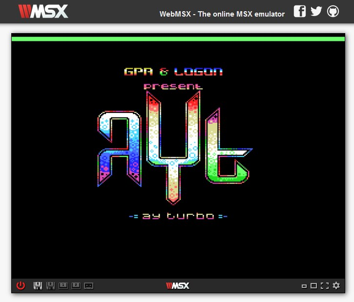

## Appel de Ayt_Builder sur MSX

		ld ix,AYT_File		; AYT_File est l'adresse où se trouve le fichier AYT
		ld de,AYT_Player	; AYT_Player est l'adresse où le player sera construit
        ld a,2	; Nb of loop for the music
		call AYT_Builder	; Build the player @DE for file pointed by @IX for "A" loop

Pour jouer la musique, il faut appeler le *player* à la fréquence requise. 
La majorité des musiques nécessitent que le *player* soit appelé périodiquement 50 fois par seconde.

Sur MSX, la fréquence de rafraichissement vidéo est souvent de 60 Hz.
L'entête du fichier **AYT** indique cette période. 

Il est très **important de s'assurer qu'aucune interruption ne pourra avoir lieu pendant l'appel du player**. Si vous n'êtes pas familier avec le système des interruptions en Z80A, vous pouvez utiliser l'instruction **DI** avant l'appel du *player*.

		call AYT_Player	; Joue la musique

### Option de compilation
#### PlayerAcessByJP

Si l'option PlayerAcessByJP vaut 1, il faut également définir l'adresse de retour du *player*.

		ld ix,AYT_File			; AYT_File est l'adresse où se trouve le fichier AYT
		ld de,AYT_Player		; AYT_Player est l'adresse où le player sera construit
		ld hl,AYT_Player_Ret		; AYT_Player_Ret est l'adresse à laquelle le player revient
		ld a,2				; A indique combien de fois la musique sera jouée
		call Ayt_Builder

On retrouve l'adresse de retour derrière l'appel du *player* 

			jp AYT_Player	; Joue la musique
	AYT_Player_Ret			; Adresse de retour du player

## Initialisation
Si le compresseur identifie des registres *inactifs*, ils sont exclus des données **AYT** mais nécessitent néanmoins une initialisation préalable.

Il est nécessaire d'appeler une fonction d'initialisation avant d'appeler le *player*.

La fonction *Ayt_Builder* construit une routine d'initialisation qui doit être appelée **avant** l'utilisation du *player*.

A la sortie de la fonction *Ayt_Builder*:
- le registre **HL** contient l'adresse de la routine d'initialisation.
- le registre **DE** contient le pointeur sur le premier octet libre après le *player* (ou la routine d'initialisation).

**Remarque :**

Si le fichier ne contient aucun registre inactif, la routine d'initialisation devient inutile.
Dans ce cas, la fonction d'initialisation pointera sur un RET (et la routine d'initialisation occupera alors 1 octet au lieu de 16 dans le player).

Voici le traitement à mettre en place pour appeler une routine d'initialisation 

		ld ix,AYT_File		; AYT_File est l'adresse où se trouve le fichier AYT
		ld de,AYT_Player	; AYT_Player est l'adresse où le player sera construit
        ld a,2	; Nb of loop for the music
		call AYT_Builder	; Build the player @DE for file pointed by @IX for "A" loop

		ld (InitPlayer),hl	; Mise a jour de la routine d'initialisation
		...
		...
	InitPlayer equ $+1
		call 0			; Après la mise à jour, CALL sera sur la routine d'initialisation

## Périodicité d'appel de Ayt_Player
La périodicité d'appel du *player* est généralement basée sur la fréquence de l'écran.
Sur **MSX** il est fréquent que le balayage soit à **60 Hz**, ce qui se traduira par une vitesse de lecture plus rapide de la musique si cette dernière a été composée avec une fréquence de **50 Hz**.
Cette information est disponible dans l'entête du fichier **AYT** (voir la description du format **AYT**).

**Avertissement :** Le *player* a été testé sur l'émulateur **OPEN MSX 21.0** avec la machine **SONY HB F1XD** et la rom **"MSX BASIC Version 2"**. 

Afin de tester la Vsync, le code suivant a été utilisé.

D'abord une pré initialisation **VDP**

        xor a
        out (0x99h),a
        ld a,128+15
        out (0x99h),a

Puis ensuite une attente de Vsync :

    Wait_Vsync
        in a,(0x99h)    ; lire VDP Status
        rlca
        jr nc,Wait_Vsync

## Pré-Construction
Il est tout à fait possible de ***"pré construire"*** le *player*.

Vous pouvez utiliser *Ayt_Builder* pour créer préalablement le *player* et initialiser le fichier **AYT**.
Il suffit de sauvegarder le player créé et le fichier **AYT** mis à jour après l'appel de la fonction.

Vous pouvez ensuite intégrer le *player* et le fichier **AYT** en prenant soin de les replacer aux adresses définies lors de l'appel à *Ayt_Builder*.

## Performances

Les performances en temps d'exécution et de place mémoire du Player dépendent de plusieurs facteurs:
- Le nombre de registres actifs détectés par le compresseur (au maximum de 14).
- La *méthode d'appel* du *player* (**CALL** ou **JP**) sur toutes les plateformes.

La *méthode d'appel* correspond à la façon dont le *player* est appelé en Z80A.
Cette méthode est une option de compilation du *builder*.
- Lorsque la *méthode d'appel* est de type **CALL**, le programme qui utilise le *player* doit l'appeler avec l'instruction Z80A **"CALL"**
- Lorsque la *méthode d'appel* est de type **JP**, le *player* doit être appelé avec l'instruction Z80A **"JP"**. Cette méthode nécessite toutefois que le programmeur fournisse au *builder* l'adresse de retour du *player*.
  - Le *player* ne sauvegarde alors pas le registre **SP**, ce qui permet de *"gagner"* **11 nops** (sur **CPC**) ou **37 Ts**.
  - C'est une option intéressante seulement si le programme qui appelle le player devait de toute manière modifier le registre **SP**.
  - Dans les autres cas, elle présente les problèmes suivants :
    - elle impose d'appeler le *builder* à chaque fois que l'adresse de retour change :
      - cela peut se produire fréquemment en *développement*, ce qui impose d'avoir le *builder* en ram.
      - cela peut se produire si il est nécessaire d'appeler le *player* de plusieurs endroits différents.
    - elle impose de restaurer le pointeur de pile car le moindre push ou call serait destructeur pour les données **AYT**.
  
Le tableau ci-dessous détaille les performances du *player* entre 10 et 14 registres actifs pour les deux *méthodes d'appel* possibles.

| Méthode Appel | Nombre Registres | CPU en Tstates | Taille Player | Taille Builder |
| :-----------: | :--------------: | :---------: | :-----------: | :------------: |
| JP            | 10               | 643         | 136           | 348            |
| JP            | 11               | 692         | 142           | 348            |    
| JP            | 12               | 741         | 148           | 348            |        
| JP            | 13               | 790         | 155           | 348            |        
| JP            | 14               | 839         | 161           | 348            |  
| CALL          | 10               | 680         | 141           | 363            |
| CALL          | 11               | 729         | 147           | 363            |
| CALL          | 12               | 778         | 153           | 363            |
| CALL          | 13               | 827         | 160           | 363            |
| CALL          | 14               | 876         | 166           | 363            |

