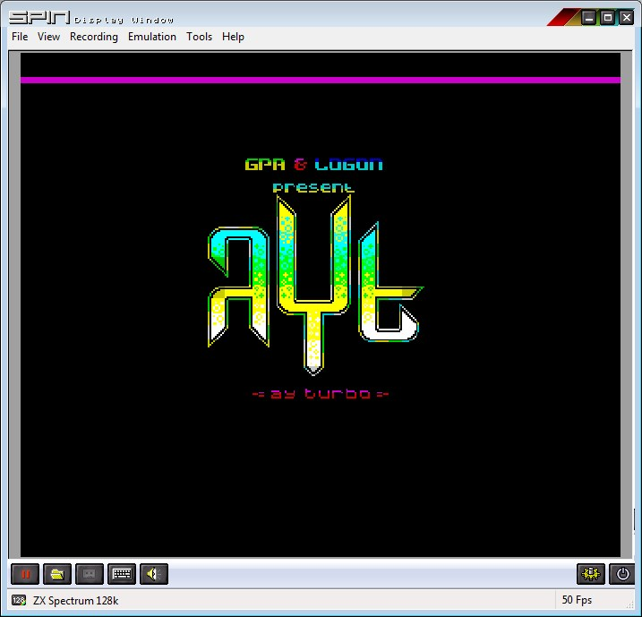

## Appel de Ayt_Builder sur ZX SPECTRUM 128/+2/+3

		ld ix,AYT_File		; AYT_File est l'adresse où se trouve le fichier AYT
		ld de,AYT_Player	; AYT_Player est l'adresse où le player sera construit
		ld bc,AYT_Init			; AYT_Init est l'adresse ou est créée la fonction d'initialisation si <>de 0
            ld a,1	; Nb of loop for the music
		call AYT_Builder	; Build the player @DE for file pointed by @IX for "A" loop

Pour jouer la musique, il faut appeler le *player* à la fréquence requise. 
La majorité des musiques nécessitent que le *player* soit appelé périodiquement 50 fois par seconde.
L'entête du fichier *AYT* indique cette période. 

Il est très **important de s'assurer qu'aucune interruption ne pourra avoir lieu pendant l'appel du player**. Si vous n'êtes pas familier avec le système des interruptions en **Z80A**, vous pouvez utiliser l'instruction **DI** avant l'appel du *player*.

		call AYT_Player	; Joue la musique

### Option de compilation
#### PlayerAcessByJP

Si l'option PlayerAcessByJP vaut 1, il faut également définir l'adresse de retour du *player*.

		ld ix,AYT_File			; AYT_File est l'adresse où se trouve le fichier AYT
		ld de,AYT_Player		; AYT_Player est l'adresse où le player sera construit
		ld bc,AYT_Init			; AYT_Init est l'adresse ou est créée la fonction d'initialisation si <>de 0
		ld hl,AYT_Player_Ret		; AYT_Player_Ret est l'adresse à laquelle le player revient
		ld a,2				; A indique combien de fois la musique sera jouée
		call Ayt_Builder

On retrouve l'adresse de retour derrière l'appel du *player* 

			jp AYT_Player	; Joue la musique
	AYT_Player_Ret			; Adresse de retour du player

## Initialisation
Si le compresseur identifie des registres *inactifs*, ils sont exclus des données **AYT** mais nécessitent néanmoins une initialisation préalable.

Il est nécessaire d'appeler une fonction d'initialisation avant d'appeler le player.

La fonction *Ayt_Builder* construit une routine d'initialisation qui sera appelée **avant** l'utilisation du *player*.
Deux alternatives se présentent en entrée de la fonction:
- Si le registre **BC vaut 0**, alors la fonction *AYT_Builder* va réserver **16 octets** après le *player* pour créer cette routine.
- Si le registre **BC est différent de 0**, il doit alors contenir l'adresse d'une zone réservée de **16 octets** (qui peut se situer n'importe ou en ram). Cette zone peut être récupérée par le programme après initialisation.

A la sortie de la fonction *Ayt_Builder*:
- le registre **HL** contient l'adresse de la routine d'initialisation (il vaut donc BC (en entrée) si ce dernier était non nul).
- le registre **DE** contient le pointeur sur le premier octet libre après le *player* (ou la routine d'initialisation).

**Remarque :**

Si le fichier ne contient aucun registre inactif, la routine d'initialisation devient inutile.
Dans ce cas, la fonction d'initialisation pointera sur un RET (et la routine d'initialisation occupera alors un octet au lieu de 34).

Voici le traitement à mettre en place pour appeler une routine d'initialisation 

		ld ix,AYT_File		; AYT_File est l'adresse où se trouve le fichier AYT
		ld de,AYT_Player	; AYT_Player est l'adresse où le player sera construit
		ld bc,AYT_Init			; AYT_Init est l'adresse ou est créée la fonction d'initialisation si <>de 0
            ld a,2	; Nb of loop for the music
		call AYT_Builder	; Build the player @DE for file pointed by @IX for "A" loop

		ld (InitPlayer),hl	; Mise a jour de la routine d'initialisation
		...
		...
	InitPlayer equ $+1
		call 0			; Après la mise à jour, CALL sera sur la routine d'initialisation

## Périodicité d'appel de Ayt_Player
La périodicité d'appel du *player* est généralement basée sur la fréquence de l'écran, qui est de 50 Hertz. 
Cette information est disponible dans l'entête du fichier **AYT** (voir la description du format **AYT**).

**Avertissement :** Le player a été testé sur l'émulateur **ZX SPIN 0.666** qui dispose d'un assembleur intégré mais qui s'est avéré assez buggé sur ma machine.

A priori, il n'existe pas de signal Vsync testable sur ZX SPECTRUM 128.

Il existe cependant une interruption produite une fois par frame.
Sur le Z80A en mode IM 1, une interruption génère un **RST 0x38h**, qui représente un **CALL 0x0038h**.
Cependant la ROM, qui ne peut pas être déconnectée de l'espace adressable, débute en 0x0000.
L'appel des interruptions a donc lieu dans la ROM, qui semble ne pas avoir prévu de passerelle en RAM.

Fort heureusement, le Z80A permet de déplacer ses interruptions via le mode IM2 (mode vectorisé).
Ce mode a rarement été exploité dans les architectures des anciennes plateformes.
Pour l'utiliser il faut tricher un peu pour contourner l'absence de périphériques vectorisés, et construire une table de vecteurs compatible avec toutes les situations.

Sans rentrer dans des considérations trop techniques qui dépasseraient le cadre de ce document, voici la méthode employée pour cadencer l'appel de *AYT_Player**

		;
		; Swith to Im2
            ; 
		ld bc,256		; 257 bytes to write
		ld a,&c9		; between C900 and CA00 included
		ld h,a			; with C9 byte = RET
		ld l,c
		ld (hl),a
		ld d,h
		ld e,b
		ldir
		ld i,a			; Msb of vector tab
		im 2           ; switch to interrupt mode 2

Ainsi c'est l'instruction Z80A **HALT**, placée derrière le EI qui attend que l'interruption Vsync se produise.
La table d'interruption créé entre **0xC900h et 0xCA00h contient** des **0xC9h**, qui correspondent à l'instruction **RET** en Z80A.
Une fois que l'interruption s'est produite, elle ne peut plus se reproduire avant le prochain **EI**.

		di
		call AYT_Player
		ei			; Int authorized
		halt		; wait for irq on vsync via Im2

## Pré-Construction
Il est tout à fait possible de ***"pré construire"*** le *player*.

Vous pouvez utiliser *Ayt_Builder* pour créer préalablement le *player* et initialiser le fichier **AYT**.
Il suffit de sauvegarder le player créé et le fichier **AYT** mis à jour après l'appel de la fonction.

Vous pouvez ensuite intégrer le *player* et le fichier **AYT** en prenant soin de les replacer aux adresses définies lors de l'appel à *Ayt_Builder*.

## Performances

Les performances en temps d'exécution et de place mémoire du Player dépendent de plusieurs facteurs:
- Le nombre de registres actifs détectés par le compresseur (au maximum de 14).
- La *méthode d'appel* du *player* (**CALL** ou **JP**) sur toutes les plateformes.
- La configuration de *connexion/déconnexion* de la **page Asic** évoquée précédemment.

La *méthode d'appel* correspond à la façon dont le *player* est appelé en Z80A.
Cette méthode est une option de compilation du *builder*.
- Lorsque la *méthode d'appel* est de type **CALL**, le programme qui utilise le *player* doit l'appeler avec l'instruction Z80A **"CALL"**
- Lorsque la *méthode d'appel* est de type **JP**, le *player* doit être appelé avec l'instruction Z80A **"JP"**. Cette méthode nécessite toutefois que le programmeur fournisse au *builder* l'adresse de retour du *player*.
  - Le *player* ne sauvegarde alors pas le registre **SP**, ce qui permet de *"gagner"* **11 nops** (sur **CPC**) ou **37 Ts**.
  - C'est une option intéressante seulement si le programme qui appelle le player devait de toute manière modifier le registre **SP**.
  - Dans les autres cas, elle présente les problèmes suivants :
    - elle impose d'appeler le *builder* à chaque fois que l'adresse de retour change :
      - cela peut se produire fréquemment en *développement*, ce qui impose d'avoir le *builder* en ram.
      - cela peut se produire si il est nécessaire d'appeler le *player* de plusieurs endroits différents.
    - elle impose de restaurer le pointeur de pile car le moindre push ou call serait destructeur pour les données **AYT**.
  
Le tableau ci-dessous détaille les performances du *player* entre 10 et 14 registres actifs pour les deux *méthodes d'appel* possibles.

| Méthode Appel | Nombre Registres | CPU en Tstates | Taille Player | Taille Builder |
| :-----------: | :--------------: | :---------: | :-----------: | :------------: |
| JP            | 10               | 685         | 148           | 338            |
| JP            | 11               | 738         | 155           | 338            |    
| JP            | 12               | 791         | 162           | 338            |        
| JP            | 13               | 844         | 169           | 338            |        
| JP            | 14               | 897         | 176           | 338            |  
| CALL          | 10               | 722         | 153           | 353            |
| CALL          | 11               | 775         | 160           | 353            |
| CALL          | 12               | 828         | 167           | 353            |
| CALL          | 13               | 881         | 174           | 353            |
| CALL          | 14               | 934         | 181           | 353            |

